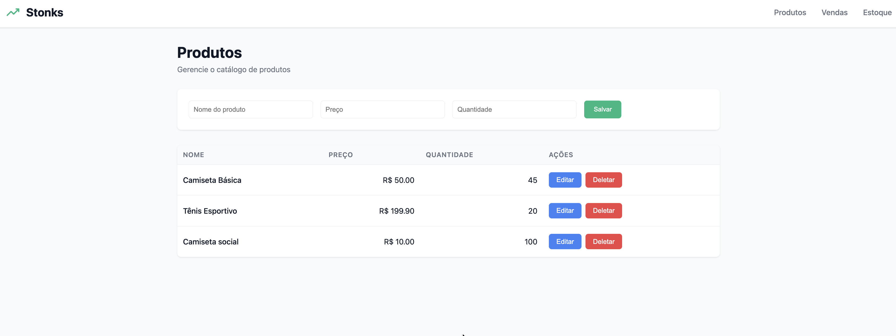

# 📈 Stonks - Sistema de Gestão Empresarial

> Criado com muito amor durante o **AWS Vibe Coding Dojo** no **DevFest Pernambuco 2025** 🚀  
> Desenvolvido em uma sessão de 2 horas para demonstrar o poder de prototipagem rápida!

MVP de sistema de gestão focado em Vendas e Estoque para microempresários.



## ✨ Funcionalidades MVP

- ✅ Cadastro de Produtos (nome, preço, quantidade)
- ✅ Registro de Vendas com baixa automática no estoque
- ✅ Visualização de Estoque atualizado
- ✅ Histórico de vendas
- ✅ Interface moderna e responsiva

## 🛠️ Stack Tecnológica

### Backend
- FastAPI
- SQLAlchemy
- SQLite
- Python 3.11+

### Frontend
- React
- Vite
- Axios
- React Router

Para detalhes completos da stack e estrutura do projeto, consulte [docs/stack-tecnologia.md](docs/stack-tecnologia.md)

## 📋 Pré-requisitos

- **Python 3.11+** ([Download](https://www.python.org/downloads/))
- **Node.js 18+** e npm ([Download](https://nodejs.org/))
- Git (opcional, para clonar o repositório)

## 🚀 Como Executar

### Backend

```bash
cd backend

# Criar ambiente virtual
python -m venv venv
source venv/bin/activate  # No Windows: venv\Scripts\activate

# Instalar dependências
pip install -r requirements.txt

# Executar servidor
uvicorn main:app --reload
```

O backend estará disponível em: http://localhost:8000  
Documentação da API (Swagger): http://localhost:8000/docs

### Frontend

```bash
cd frontend

# Instalar dependências
npm install

# Executar aplicação
npm run dev
```

O frontend estará disponível em: http://localhost:5173

## 🧪 Testando o Sistema

1. Acesse http://localhost:5173
2. Cadastre alguns produtos (ex: "Bolo de Chocolate", R$ 25,00, 10 unidades)
3. Vá em "Vendas" e registre uma venda
4. Confira em "Estoque" que a quantidade foi atualizada automaticamente

## ⚠️ Limitações Conhecidas

Este é um MVP criado em 2 horas para demonstração. Limitações incluem:

- Sem autenticação/autorização
- Sem suporte a múltiplos usuários
- Sem backup automático
- Sem relatórios avançados
- Sem integração com sistemas externos
- Banco de dados local (SQLite) - dados não persistem entre máquinas
- Sem validação de estoque negativo em edições manuais
- Sem histórico de alterações de produtos

## 📁 Documentação

- [Visão do Produto](docs/produto.md)
- [Fases do Projeto](docs/fases-projeto.md)
- [Stack Tecnológica](docs/stack-tecnologia.md)
- [Padrões Frontend](docs/padroes-frontend.md)
- [Padrões Backend](docs/padroes-backend.md)

## 🎯 Próximas Fases (Hipotéticas)

- Fase 2: Compras e relatórios
- Fase 3: Produção e clientes
- Fase 4: Logística e faturamento
- Fase 5: Contabilidade e pós-venda

Veja detalhes em [docs/fases-projeto.md](docs/fases-projeto.md)

## 💚 Sobre o Projeto

Este projeto nasceu durante o AWS Vibe Coding Dojo no DevFest Pernambuco 2025, onde demonstramos como criar um sistema funcional e com identidade visual em apenas 2 horas.

**Feito com ❤️ pela comunidade AWS no DevFest PE**
